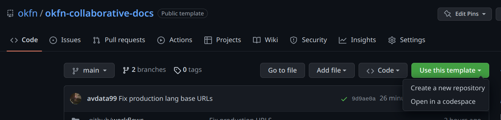

[](https://github.com/okfn/okfn-collaborative-docs/actions/workflows/page.yml)

# OKFN Collaborative Documentation tool

This is a GitHub template to create multilanguage collaborative documentation with a
public html site and a PDF version. It's based on [mkdocs](https://www.mkdocs.org).   

## Creating my first documentation

At this [repo url](https://github.com/okfn/okfn-collaborative-docs/)
click on the _Use this template_ + _Create new repository_ button
or go directly to the [generate from template url](https://github.com/okfn/okfn-collaborative-docs/generate)



Do not forget to define your new repository as **Public**.  

### Prepare your local environment.

Clone your new pository and install the project requirements.
This is an example for Linux/Ubuntu:

```bash
# Clone your new repository 
git clone git@github.com:YOUR-ORG/YOUR-REPO-NAME.git
# Create a Python3 virtual environment
python3 -m venv /path/to/new/virtual/environment
# Activate the virtual environment
source /path/to/new/virtual/environment/bin/activate
# Install the project requirements
cd YOUR-REPO-NAME
pip install -r requirements.txt
``` 

### Define your custom settings

Your main configuration file is `/conf/custom.yml`.  

First of all, you need to define your site name and the languages you want to use.  
Define languages at `custom_extra`->`alternate` and the site name at `site_name`.  

```yaml
custom_extra:
  # define all available languages
  alternate:
    - name: English
      lang: en
    - name: Español
      lang: es
```

```yaml
site_name:
    en: My site name
    es: Mi sitio
```

You can add as many languages as you want. 
All languages will be required for other multilanguage configurations.  

Now define your URL related settings.

```yaml
site_url: https://USER.github.io/YOU-REPO-NAME
# Or https:/your-doc-site.org if you have a custom domain and point it to GitHub Pages
repo_url: https://github.com/USER/YOU-REPO-NAME

# Usually required for github pages. This is a base path for all URLs
# Your site will be available at https://USER.github.io/YOU-REPO-NAME so all URLs
# will be relative to this path
public_url_base_path: /YOU-REPO-NAME
# or empty public_url_base_path: 
# if you have a custom domain
```

The `site_description`, `copyright` and `site_author` are self-explanatory.  

If you need to define custom context values to use in your templates, you can do it with the `custom_extra` setting.  

Some examples:

```yaml
custom_extra:

  # other custom extras (like alternate for )...
  # define custom context values

  my_value: Some text (will be available for all .md and .html files as {{ my_value }})
  my_dict:
    some_key: "my custom value in english" (will be available for all .md and .html files as {{ my_dict.some_key }})
    some_key2: "mi valor personalizado en español"
  my_list:
    # available to iterate with  {{ item }} 
    - "my custom value in english" (will be available for all .md and .html files as {{ my_list.0 }})
    - "mi valor personalizado en español"
  my_list_of_dicts:
    # available to iterate with  {{ k }}: {{ v }} 
    - some_key: "my custom value in english"
    - some_key2: "mi valor personalizado en español"
```

### Define the site structure

The `nav` setting is the main configuration for the site structure.  
You need to add a sub-section for each language (`nav-en`, `nav-es`, etc).  

Inside the `page/docs` folder you need to create (if not exists) a folder
for each language (`docs-en`, `docs-es`, etc).  

Inside each language folder you need to create (if not exists) the same
files described in the `nav-LANG` setting.  

### Custom site styles and javascript

If you need custom CSS styles, you can add them to the `page/assets/css/custom.css` file.  
If you need custom javascript, you can add them to the `page/assets/js/app.js` file.  

### Other static resources

If you need other static resources (like images), you can add them to the `page/assets` folder and they will be availabe
at `{{ assets_folder }}` in your template/markdown files (they are several examples available in the test templates).  

For example `` or
``.  

### Prepare your site

Prepare your internal custom settings for each language and prepare the environment

```bash
python3 code/okf-collab.py build-config
```

For a list of common errors building your site, see [here](docs/build-errors.md).  

This process will create files and folders:
 - All the `conf/mkdocs-LANG.yml` required files (you don't need to touch them)
 - All the `page/docs/fixed-docs-LANG` required folder with an updated version of your MD files
 - Copy all assets to the `site` folder.

You don't need to touch any of this resources. They are _.gitignored_ and will be used to build the site.  

**You are now ready to deploy your site to GitHub pages**, just push your changes to GitHub.  
You can check the build process at the _Actions_ tab (https://github.com/USER/REPO-NAME/actions).  
Once the GitHub action finished, you'll need to enable github pages at https://github.com/USER/REPO-NAME/settings/page
and select the `gh-pages` branch.  


After some minutes (GitHub will process your static site), your site will be available at https://USER.github.io/REPO-NAME  

#### Build your local site

You can also test you site locally and skip waiting for each GitHub action to finish.  
You can do this by builing the site locally and serving it with a local server.  

```
python3 code/okf-collab.py build-local-site
```

Serve the site locally

```
python3 code/okf-collab.py serve
```

You'll see `serving at http://localhost:8033` and your local site is now redy to test with
all the languages you defined.  
**Note**: If you have a `Port in use` error, you can call
`python3 code/okf-collab.py serve -p 8034` to use a different port.  

### PDF version

A PDF version for each language is generated automatically and it will be available at:
 - English version: `/pdf/doc-en.pdf`
 - Other languages: `/LANG/pdf/doc-LANG.pdf`

The `/page/pdf/pdf-template-LANG` folder include custom styles,
cover and back cover templates for each language.  
[If you know what you're doing](https://github.com/orzih/mkdocs-with-pdf/blob/master/README.md#sample-pdf_event_hookpy-or-pdf_event_hook__init__py),
you can modify the `/pdf_event_hook.py` file.  

## More docs

More info about this project:

 - General notes: [docs/general-notes.md](docs/general-notes.md)
